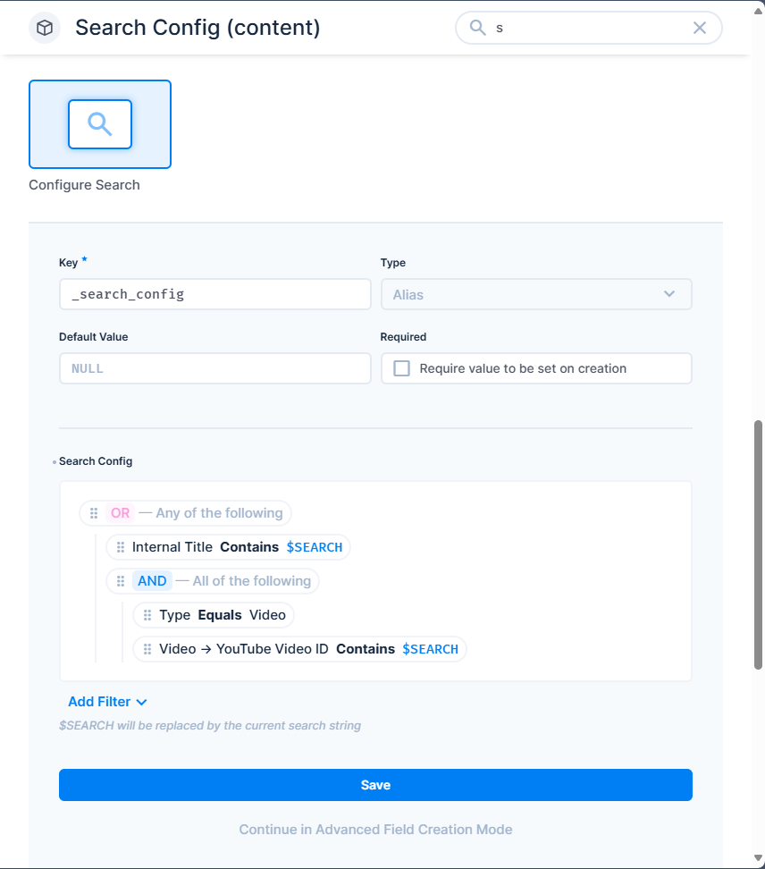

# Search Configuration for Directus

Provides a way to configure the Directus search filters for a collection. This allows you to supercharge your Directus `search` field with AND/OR groups, strict equality, case-insensitive searches, and nested relational searches, fully under your control.

# Installation

This plugin has not yet been published on NPM, but you can try installing it directly from GitHub.

# Usage

1. Add a new field named `_search_config` in the collection you with to add search configuration for.

   > **The field must have the key `_search_config` at the moment. In the future we might add a way to configure this.**

2. Configure your filter in the `Search Config` interface options. Use `$SEARCH` as a placeholder for the user's search query.

Search the collection. Both app and API searches will now use the filter pattern you've specified. You can use nested relational fields for the search.

